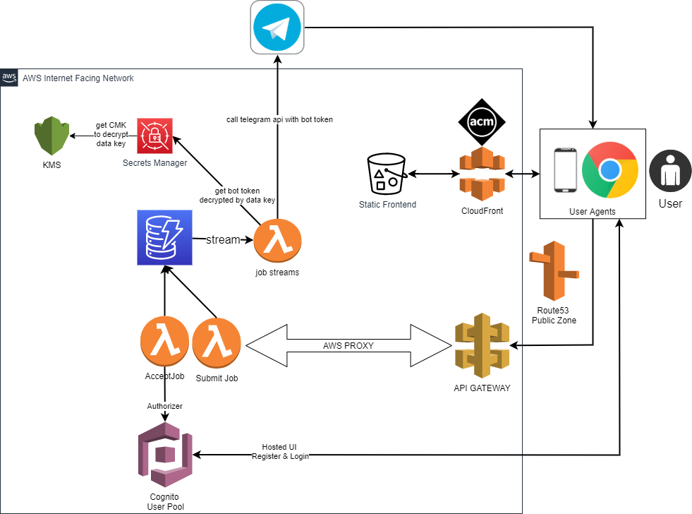

# Bickup 
Bickup is a job posting and fulfilment platform where users posts job requests to be fulfilled by service providers.

We use Bickup as an example of one such service which provides bicycles transportation services. However, this can be easily generalised to serve other kinds of services.

1. User submit job requests
2. Job alerts into telegram chat
3. Driver views details of job and accepts job (requires provider login)
4. Requester contact information revealed
5. Arrangement occur outside of platform 
6. Driver marks job as completed

## Architecture

## Tech Stack

### Frontend
Developed in GatsbyJS and served from S3.

### Backend
NodeJs running on Lambdas

### Infra
AWS CDK
APIG, Lambdas, Cognito User Pool, DyanmoDB and streams. S3, Secrets Manager and KMS, APIG cognito authorizer

## Development
npm run develop

## Deployment
Generate build for frontend
- Run npm run build in root dir of project

Generate build for backend lambdas and deploy the entire system (Build from frontend + Backend lambdas + Changes in infra if any)
- cd into serverless/cdk
- npm run deploy:dev
    1. Compiles typescript in lambdas to JS 
    2. Package assets referenced by backend lambdas to S3, generate Cloud Formation template and deploy

Ensure aws credentials are set, then

1. npm run build
2. npm run sls:local -- deploy

---
## References

### Gitlab CICD
https://about.gitlab.com/blog/2021/02/05/ci-deployment-and-environments/
